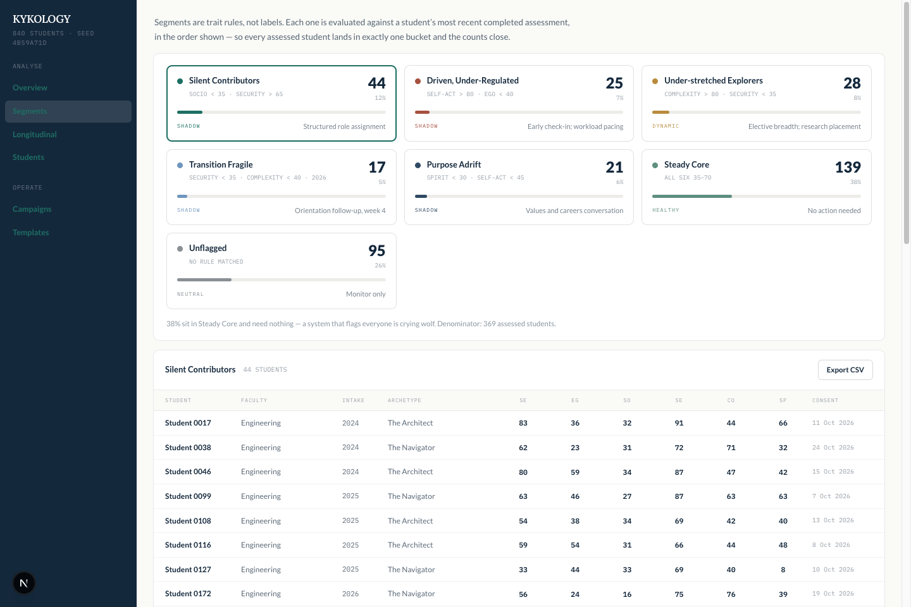

# KYKOLOGY™ Campus — admin demo

A clickable, fully explorable sales-pitch artifact for KYKOLOGY's 6D Profile, aimed at
campus administrators. Every number on screen is generated from a fixed seed. Nothing is
sent, stored, or persisted.

**Live: <https://kykology-admin-demo.cshyang-chng.workers.dev>**



## Run it

```bash
npm install
npm run dev     # http://localhost:3000
npm test        # the generator gate — see below
npm run build   # static export to out/
```

## The one rule

**Do not refactor `buildData()` in `src/lib/data/generator.ts`.**

It is a verbatim transliteration of the Claude Design prototype. Every published figure —
the seven segment counts, the archetype churn, the funnel quotas — is a function of the
mulberry32 stream seeded at `0x4B59A71D` *and the exact order `rnd()` is called in*.
Extracting a helper or reordering a loop silently changes every number on the hero screen
while the code still looks correct.

`npm test` asserts the counts exactly. If it fails after an edit, the edit is wrong.

```
  44 Silent Contributors          churn 0.3% (ceiling 8%)
  25 Driven, Under-Regulated      840 students · 4 faculties · 3 intakes
  28 Under-stretched Explorers    291 assessed twice
  17 Transition Fragile
  21 Purpose Adrift
 139 Steady Core
  95 Unflagged
  --
 369 assessed
```

## Screens

| Route | What it is |
|---|---|
| `/overview` | KPIs, five October checkpoints, the post-assessment funnel, fingerprint bars, activity, population waffle |
| `/fingerprint` | Six-axis radar, faculty separation, archetype distribution |
| `/segments` | **The hero.** Six flagged patterns with attached actions, plus the roster |
| `/longitudinal` | Dimension movement, the "22 of 55 moved out" headline, pattern migration |
| `/students/profile?id=` | The individual profile — facets, bands, pressure, watch-outs, reflection state, calibration scatter. Reached from People |
| `/campaigns` · `/campaigns/[id]` | Funnel tracking and the nudge flow |
| `/campaigns/new` | Four-step wizard: Test → Audience → Emails → Review |
| `/people` | Directory with CSV import and email dedupe |
| `/templates` | The three messages, with a live preview |
| `/t?id=&status=&from=` | **Student link.** The row's state beside what that student sees — consent, 36 items, live scoring |

## Architecture

```
 src/lib/data/generator.ts   seeded generator — DO NOT REFACTOR
 src/lib/data/derive.ts      aggregates: funnels, migration, waffle, radar inputs
 src/lib/data/layers.ts      facets, bands, pressure, watch-outs, engagement — all downstream
 src/lib/data/questions.ts   the 36-item bank, 6 per dimension
 src/lib/demo-state.tsx      React context — every mutation the demo allows
 src/app/(admin)/            every screen, including the student link at /t
```

**Mutations live in React context, never module scope.** Client components render on the
server too, so a module-level mutable store would be shared across every viewer of the
deployed demo — two people clicking at once would see each other's imports and campaigns.
State resets on reload, which is correct for a pitch demo: the next meeting starts clean
without anyone remembering to reset it.

**Design tokens.** The prototype used `rgba(20,40,60,α)` at twelve alphas. Those are not
twelve colours, they are one colour at twelve opacities — so there is a single `--color-ink`
and the alpha is expressed at the call site (`text-ink/45`, `border-ink/10`). Light mode
only, by design.

IBM Plex Mono appears at four distinct settings and they are not interchangeable — each
marks a different rank of label. They are four utilities (`eyebrow`, `nav-group`,
`seed-line`, `rule-mono`), not one utility plus tracking overrides at the call site.

Element defaults live in `@layer base`. Unlayered CSS outranks every layered utility
regardless of specificity, so an unlayered `a { color: teal }` silently beats
`text-white/62` on a link.

## Deploying

```bash
npm run build
npx wrangler deploy
```

Static export to Cloudflare Workers static assets — free plan, no adapter. See the comment
in `next.config.ts` for the constraint this imposes and the one-line change that lifts it
when the demo graduates to a pilot.

**Give it a minute before demoing.** For roughly a minute after `wrangler deploy`, routes
flap between 200 and 404 as assets propagate — `/overview` 404s while `/segments` works,
then they swap. It settles on its own. Don't go chasing a build problem that isn't there,
and don't deploy five minutes before a meeting.

## What this is not

No backend, no database, no authentication, no real email. Deliberately. See
`docs/superpowers/specs/` for the reasoning, including why D1 was considered and cut, and
which parts of that spec have since been superseded by the design project.
